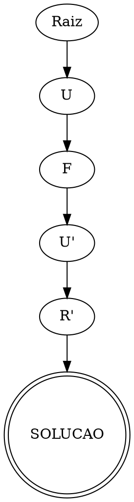

# Solucionador de Cubo Mágico 3×3 com Árvore de Estados

Trabalho de Estrutura de Dados (Árvores) em **C puro**. O programa monta uma
**árvore de busca** dos estados do cubo, encontra a solução por **BFS** ou
**A\***, mostra a sequência de movimentos, desenha a árvore da solução em ASCII
e exporta um arquivo **Graphviz** (`solution.dot`).

## Arquivos

```
cube.h / cube.c        -> representação do cubo e movimentos
solver.h / solver.c    -> árvore (Node/Tree), hash de visitados, BFS e A*
graphviz.h / graphviz.c-> exportação para Graphviz (.dot)
main.c                 -> programa principal
entrada.txt            -> exemplo de entrada (cubo embaralhado)
Makefile               -> compilação
RELATORIO.md           -> relatório técnico completo
```

## Compilação

```bash
make
# ou, diretamente:
gcc main.c cube.c solver.c graphviz.c -o cubo
```

> Observação: como o projeto está dividido em módulos, a compilação inclui os
> quatro arquivos `.c`. O `gcc main.c -o cubo` sozinho não basta porque as
> implementações estão separadas (boa prática de Estrutura de Dados).

## Execução

```bash
./cubo entrada.csv          # busca em largura (BFS) — padrão
./cubo entrada.csv astar    # busca A* (heurística admissível)
./cubo entrada.csv bidir    # BFS bidirecional (alcança cubos mais profundos)
./cubo scramble 6           # gera um embaralhamento de 6 giros em entrada.csv
```

### Qual algoritmo usar?

| Algoritmo | Garante mínimo? | Alcance prático | Memória |
|---|---|---|---|
| `bfs` (padrão) | sim | ~7 movimentos | alta |
| `astar` | sim | ~7 movimentos | menor que BFS |
| `bidir` | sim | **~11–12 movimentos** | bem menor |

O **BFS bidirecional** cresce duas árvores ao mesmo tempo — uma a partir do
cubo embaralhado e outra a partir do resolvido — que se encontram no meio.
Como cada árvore só precisa chegar a ~metade da profundidade, ele resolve
embaralhamentos bem mais fundos com a mesma memória. É o recomendado para
cubos reais embaralhados à mão.

## Formato da entrada

São **54 cores** na ordem de faces **Cima, Esquerda, Frente, Direita, Trás,
Baixo**. Cores: `Y` amarelo, `W` branco, `G` verde, `B` azul, `R` vermelho,
`O` laranja.

O leitor aceita **dois formatos** (separadores são sempre ignorados):

1. **String única** (`entrada.txt`):

   ```
   WWRWWRWWWOOOOOGOOGGGGRGGRGGRYYYRRYRRBBBWBBWBBYOOYYBYYB
   ```

2. **CSV** (`entrada.csv`) — uma face por linha, cores separadas por vírgula.
   Linhas iniciadas por `#` são **comentários** (ignoradas):

   ```csv
   # Ordem das faces: Cima, Esquerda, Frente, Direita, Tras, Baixo
   W,W,R,W,W,R,W,W,W
   O,O,O,O,O,G,O,O,G
   G,G,G,R,G,G,R,G,G
   R,Y,Y,Y,R,R,Y,R,R
   B,B,B,W,B,B,W,B,B
   Y,O,O,Y,Y,B,Y,Y,B
   ```

Rodar com qualquer um: `./cubo entrada.csv` ou `./cubo entrada.txt`.

Se não houver exatamente 54 cores válidas (9 de cada), o programa imprime:

```
Estado invalido do cubo.
```

## Exemplo completo de execução

O `entrada.txt` que acompanha o projeto é o cubo resolvido após o embaralhamento
`R U F' U'`. Saída do programa:

```
=== Cubo Magico 3x3 - Solucionador por Arvore de Estados ===

Estado inicial informado:
        W W R
        W W R
        W W W
O O O G G G R Y Y B B B
O O G R G G Y R R W B B
O O G R G G Y R R W B B
        Y O O
        Y Y B
        Y Y B

String: WWRWWRWWWOOOOOGOOGGGGRGGRGGRYYYRRYRRBBBWBBWBBYOOYYBYYB

Algoritmo de busca: BFS (busca em largura)

Nos gerados na arvore: 17065

Quantidade de movimentos: 4

Movimentos:
U F U' R'

Arvore da solucao:
Raiz
    └── U
        └── F
            └── U'
                └── R'
                    └── SOLUCAO

Arquivo 'solution.dot' gerado (visualize com: dot -Tpng solution.dot -o saida.png).
```

Com `astar`, a solução é a mesma (`U F U' R'`), mas a árvore gera apenas
**800 nós** em vez de 17.065 — demonstrando o ganho da heurística.

## Visualizar a árvore com Graphviz

```bash
dot -Tpng solution.dot -o saida.png
```

Conteúdo de `solution.dot` (exemplo):



## Detalhes técnicos

Veja [RELATORIO.md](RELATORIO.md): estruturas de dados, construção e expansão da
árvore, BFS vs A*, controle de visitados, reconstrução do caminho, complexidade
temporal/espacial e a diferença entre **árvore** e **grafo** no contexto do
problema.
